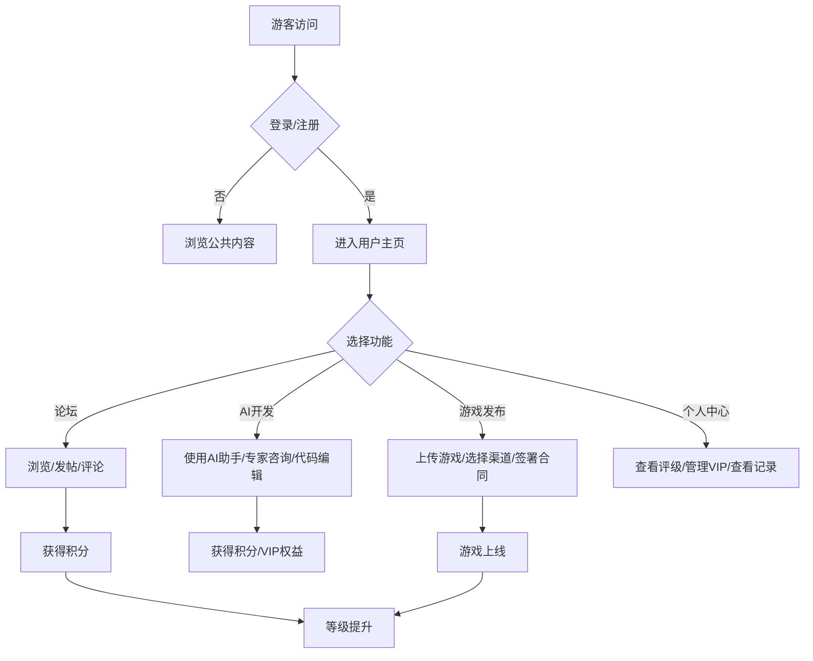

# DevRealm 平台产品需求文档

## 1. Product Overview

DevRealm 是一个融合社区论坛、AI 辅助开发与游戏多渠道发行的综合性 SaaS 平台，旨在解决游戏开发者面临的资源分散、工具割裂、发行链路长的核心痛点。平台覆盖从创意构思、技术实现到上线发行的完整链路，面向游客、注册用户与管理员三类角色提供差异化服务。

## 2. Core Features

### 2.1 User Roles

| Role | Registration Method | Core Permissions |
|------|---------------------|------------------|
| 游客 | 无需注册 | 浏览论坛帖子、查看AI工具介绍、浏览发布渠道、查看公共评级 |
| 注册用户 | Email/第三方登录 | 发布论坛帖子、参与讨论、使用AI辅助开发工具、发布游戏、查看个人中心、购买VIP |
| VIP专家 | 付费订阅/审核认证 | 高级AI功能、专家咨询通道、优先技术支持、专家标识 |
| 管理员 | 后台注册 | 内容管理、用户管理、系统配置、数据分析、审核管理 |

### 2.2 Feature Module

1. **首页**: 平台概览、热门内容、快捷入口
2. **游戏开发论坛**: 帖子列表、发帖、评论、搜索、分类浏览、站内浏览器
3. **AI辅助开发**: AI代码助手、架构设计、技术支持、专家团队咨询、在线代码编辑器
4. **游戏发布中心**: 游戏上传、多渠道发布、合同管理、发布状态追踪
5. **个人中心**: 用户信息、评级体系、VIP管理、发布记录、收藏管理
6. **管理员后台**: 用户管理、内容审核、系统配置、数据统计

### 2.3 Page Details

| Page Name | Module Name | Feature description |
|-----------|-------------|---------------------|
| 首页 | Hero Banner | 动态轮播展示平台核心价值与活动 |
| 首页 | 快捷入口 | 四大板块快速导航 |
| 首页 | 热门内容 | 论坛热帖、AI工具推荐、新发布游戏 |
| 论坛首页 | 帖子列表 | 分类筛选、搜索、排序 |
| 论坛首页 | 发帖按钮 | 快速创建新话题 |
| 论坛详情 | 帖子内容 | Markdown渲染、代码高亮 |
| 论坛详情 | 评论区 | 多级回复、点赞 |
| 论坛详情 | 站内浏览器 | 内嵌浏览器窗口，支持站内外搜索 |
| AI开发 | AI助手 | 代码生成、架构建议、问题解答 |
| AI开发 | 专家咨询 | VIP用户专属专家团队对接 |
| AI开发 | 代码编辑器 | 在线IDE，支持多种语言 |
| 游戏发布 | 游戏上传 | 项目文件上传、信息填写 |
| 游戏发布 | 渠道选择 | 多平台一键投递 |
| 游戏发布 | 合同管理 | 发布协议、分成方案 |
| 游戏发布 | 状态追踪 | 实时查看发布进度 |
| 个人中心 | 用户信息 | 头像、昵称、简介、等级 |
| 个人中心 | 评级系统 | 信誉分、贡献值、成就徽章 |
| 个人中心 | VIP管理 | 订阅状态、升级入口 |
| 个人中心 | 我的发布 | 游戏发布历史 |
| 个人中心 | 收藏管理 | 收藏的帖子和游戏 |
| 管理后台 | 用户管理 | 用户列表、权限设置、封禁操作 |
| 管理后台 | 内容审核 | 帖子审核、评论审核、游戏审核 |
| 管理后台 | 系统配置 | 全局设置、公告管理 |
| 管理后台 | 数据统计 | 平台数据分析、趋势图表 |
| 登录/注册 | 用户认证 | 邮箱登录、第三方登录、验证码 |

## 3. Core Process

### 用户浏览流程
游客进入首页 → 浏览论坛/AI工具/发布中心 → 注册登录 → 参与社区互动

### AI辅助开发流程
用户进入AI开发页面 → 输入需求/代码 → AI生成建议 → 专家审核（VIP）→ 在线编辑 → 导出代码

### 游戏发布流程
用户进入发布中心 → 上传游戏文件 → 填写信息 → 选择发布渠道 → 签署合同 → 提交审核 → 发布上线

### 评级体系流程
用户参与社区活动 → 获得积分/徽章 → 等级提升 → 解锁特权

## 4. User Interface Design

### 4.1 Design Style

- **Primary Color**: Deep Purple (#6B21A8) - 代表创意与科技的融合
- **Secondary Color**: Electric Blue (#0EA5E9) - 代表创新与活力
- **Accent Color**: Neon Green (#22C55E) - 用于成功状态和突出强调
- **Background**: Dark gradient with subtle grid patterns for tech feel
- **Button Style**: Rounded-xl, glass morphism effect, hover glow
- **Font**: 
  - Display: Orbitron (futuristic tech feel)
  - Body: Inter (clean, readable)
- **Layout**: Modern card-based with floating elements, subtle animations
- **Icon Style**: Lucide icons with custom coloring, animated states

### 4.2 Page Design Overview

| Page Name | Module Name | UI Elements |
|-----------|-------------|-------------|
| 首页 | Hero Banner | Large gradient background, animated particles, floating cards, CTA buttons |
| 首页 | 快捷入口 | Four animated icons with hover effects, glass cards |
| 首页 | 热门内容 | Horizontal scrollable cards, thumbnail previews, trending tags |
| 论坛首页 | 帖子列表 | Masonry layout, colored category badges, voting buttons, read time |
| 论坛详情 | 帖子内容 | Code blocks with syntax highlighting, embedded media, share buttons |
| 论坛详情 | 站内浏览器 | Split-screen layout, search bar, navigation controls |
| AI开发 | AI助手 | Chat interface with typing indicators, code blocks, copy buttons |
| AI开发 | 代码编辑器 | Dark theme IDE, line numbers, syntax highlighting, run buttons |
| 游戏发布 | 渠道选择 | Grid of platform logos, checkboxes, hover animations |
| 个人中心 | 用户卡片 | Large avatar, level badge, stats grid, progress bars |
| 个人中心 | 评级系统 | Badge collection display, achievement timeline |
| 管理后台 | 仪表盘 | Charts, metrics cards, recent activity feed |

### 4.3 Responsiveness

- **Desktop-first** design with 12-column grid
- **Tablet**: 8-column grid, collapsed sidebar
- **Mobile**: Single column, hamburger menu, touch-optimized buttons
- **Touch Optimization**: Minimum 44px touch targets, swipe gestures for cards

### 4.4 Visual Effects

- **Glass Morphism**: Used for cards, modals, navigation
- **Gradient Animations**: Subtle color shifts on hero sections
- **Particle Effects**: Background elements for tech feel
- **Hover States**: Scale transforms, glow effects, color transitions
- **Page Transitions**: Smooth fade-in and slide animations