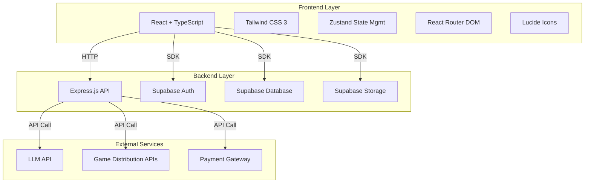
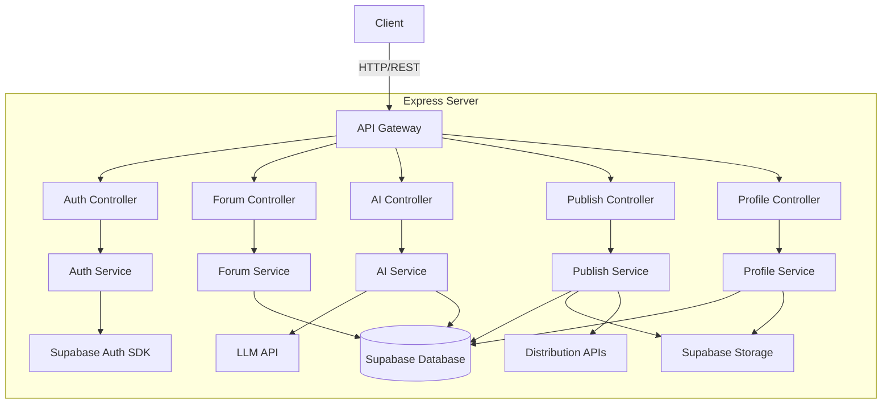
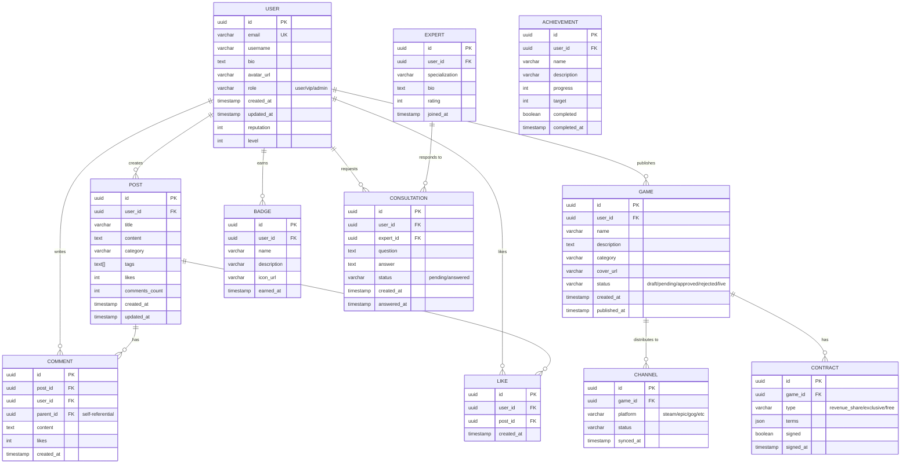

# DevRealm 平台技术架构文档

## 1. Architecture Design



## 2. Technology Description

- **Frontend**: React@18 + TypeScript + Vite@6
- **Styling**: Tailwind CSS@3 + CSS Modules
- **State Management**: Zustand
- **Routing**: React Router DOM@6
- **Icons**: Lucide React
- **Backend**: Express.js@4 + TypeScript
- **Database**: Supabase (PostgreSQL)
- **Authentication**: Supabase Auth
- **Storage**: Supabase Storage
- **LLM Integration**: OpenAI API / Custom LLM Service
- **Deployment**: Vercel (Frontend) + Supabase (Backend)

## 3. Route Definitions

| Route | Purpose | Required Auth |
|-------|---------|---------------|
| `/` | 首页 | 否 |
| `/forum` | 论坛首页 | 否 |
| `/forum/:id` | 帖子详情 | 否 |
| `/forum/new` | 发布新帖 | 是 |
| `/ai` | AI辅助开发 | 否(部分功能) |
| `/ai/chat` | AI对话助手 | 是 |
| `/ai/expert` | 专家咨询 | VIP |
| `/ai/editor` | 代码编辑器 | 是 |
| `/publish` | 游戏发布中心 | 是 |
| `/publish/new` | 新建发布 | 是 |
| `/publish/:id` | 发布详情 | 是 |
| `/profile` | 个人中心 | 是 |
| `/profile/settings` | 设置页面 | 是 |
| `/admin` | 管理后台 | 管理员 |
| `/admin/users` | 用户管理 | 管理员 |
| `/admin/content` | 内容审核 | 管理员 |
| `/admin/analytics` | 数据统计 | 管理员 |
| `/login` | 登录页面 | 否 |
| `/register` | 注册页面 | 否 |

## 4. API Definitions

### 4.1 Auth API

#### POST /api/auth/login
- **Request**: `{ email: string, password: string }`
- **Response**: `{ user: User, token: string }`

#### POST /api/auth/register
- **Request**: `{ email: string, password: string, username: string }`
- **Response**: `{ user: User, token: string }`

#### GET /api/auth/me
- **Request**: Header `Authorization: Bearer {token}`
- **Response**: `{ user: User }`

### 4.2 Forum API

#### GET /api/forum/posts
- **Request**: `{ page?: number, limit?: number, category?: string, sort?: string }`
- **Response**: `{ posts: Post[], total: number }`

#### GET /api/forum/posts/:id
- **Response**: `{ post: Post, comments: Comment[] }`

#### POST /api/forum/posts
- **Request**: `{ title: string, content: string, category: string, tags: string[] }`
- **Response**: `{ post: Post }`

#### POST /api/forum/posts/:id/comments
- **Request**: `{ content: string, parentId?: string }`
- **Response**: `{ comment: Comment }`

#### PUT /api/forum/posts/:id/like
- **Response**: `{ likes: number }`

### 4.3 AI API

#### POST /api/ai/chat
- **Request**: `{ message: string, history?: ChatMessage[] }`
- **Response**: `{ response: string }`

#### POST /api/ai/code
- **Request**: `{ prompt: string, language?: string }`
- **Response**: `{ code: string, explanation: string }`

#### POST /api/ai/architecture
- **Request**: `{ requirements: string, platform?: string }`
- **Response**: `{ design: ArchitectureDesign }`

#### GET /api/ai/experts
- **Response**: `{ experts: Expert[] }`

#### POST /api/ai/consult
- **Request**: `{ expertId: string, message: string }`
- **Response**: `{ consultation: Consultation }`

### 4.4 Publish API

#### GET /api/publish/games
- **Request**: `{ page?: number, limit?: number, status?: string }`
- **Response**: `{ games: Game[], total: number }`

#### GET /api/publish/games/:id
- **Response**: `{ game: Game }`

#### POST /api/publish/games
- **Request**: `{ name: string, description: string, category: string, files: File[] }`
- **Response**: `{ game: Game }`

#### PUT /api/publish/games/:id/channels
- **Request**: `{ channels: string[] }`
- **Response**: `{ game: Game }`

#### POST /api/publish/games/:id/contract
- **Request**: `{ contractType: string, terms: ContractTerms }`
- **Response**: `{ contract: Contract }`

### 4.5 Profile API

#### GET /api/profile/:id
- **Response**: `{ profile: Profile, stats: UserStats }`

#### PUT /api/profile
- **Request**: `{ username?: string, bio?: string, avatar?: File }`
- **Response**: `{ profile: Profile }`

#### GET /api/profile/:id/badges
- **Response**: `{ badges: Badge[] }`

#### GET /api/profile/:id/achievements
- **Response**: `{ achievements: Achievement[] }`

## 5. Server Architecture Diagram



## 6. Data Model

### 6.1 Data Model Definition



### 6.2 Data Definition Language

```sql
CREATE TABLE users (
    id UUID PRIMARY KEY DEFAULT gen_random_uuid(),
    email VARCHAR(255) UNIQUE NOT NULL,
    username VARCHAR(50) NOT NULL,
    bio TEXT,
    avatar_url VARCHAR(500),
    role VARCHAR(20) DEFAULT 'user' CHECK (role IN ('user', 'vip', 'admin')),
    created_at TIMESTAMP DEFAULT NOW(),
    updated_at TIMESTAMP DEFAULT NOW(),
    reputation INT DEFAULT 0,
    level INT DEFAULT 1
);

CREATE TABLE posts (
    id UUID PRIMARY KEY DEFAULT gen_random_uuid(),
    user_id UUID REFERENCES users(id),
    title VARCHAR(255) NOT NULL,
    content TEXT NOT NULL,
    category VARCHAR(50),
    tags TEXT[],
    likes INT DEFAULT 0,
    comments_count INT DEFAULT 0,
    created_at TIMESTAMP DEFAULT NOW(),
    updated_at TIMESTAMP DEFAULT NOW()
);

CREATE TABLE comments (
    id UUID PRIMARY KEY DEFAULT gen_random_uuid(),
    post_id UUID REFERENCES posts(id),
    user_id UUID REFERENCES users(id),
    parent_id UUID REFERENCES comments(id),
    content TEXT NOT NULL,
    likes INT DEFAULT 0,
    created_at TIMESTAMP DEFAULT NOW()
);

CREATE TABLE likes (
    id UUID PRIMARY KEY DEFAULT gen_random_uuid(),
    user_id UUID REFERENCES users(id),
    post_id UUID REFERENCES posts(id),
    created_at TIMESTAMP DEFAULT NOW()
);

CREATE TABLE games (
    id UUID PRIMARY KEY DEFAULT gen_random_uuid(),
    user_id UUID REFERENCES users(id),
    name VARCHAR(255) NOT NULL,
    description TEXT,
    category VARCHAR(50),
    cover_url VARCHAR(500),
    status VARCHAR(20) DEFAULT 'draft' CHECK (status IN ('draft', 'pending', 'approved', 'rejected', 'live')),
    created_at TIMESTAMP DEFAULT NOW(),
    published_at TIMESTAMP
);

CREATE TABLE channels (
    id UUID PRIMARY KEY DEFAULT gen_random_uuid(),
    game_id UUID REFERENCES games(id),
    platform VARCHAR(50) NOT NULL,
    status VARCHAR(20) DEFAULT 'pending',
    synced_at TIMESTAMP
);

CREATE TABLE contracts (
    id UUID PRIMARY KEY DEFAULT gen_random_uuid(),
    game_id UUID REFERENCES games(id),
    type VARCHAR(50) CHECK (type IN ('revenue_share', 'exclusive', 'free')),
    terms JSONB,
    signed BOOLEAN DEFAULT FALSE,
    signed_at TIMESTAMP
);

CREATE TABLE badges (
    id UUID PRIMARY KEY DEFAULT gen_random_uuid(),
    user_id UUID REFERENCES users(id),
    name VARCHAR(100) NOT NULL,
    description TEXT,
    icon_url VARCHAR(500),
    earned_at TIMESTAMP DEFAULT NOW()
);

CREATE TABLE achievements (
    id UUID PRIMARY KEY DEFAULT gen_random_uuid(),
    user_id UUID REFERENCES users(id),
    name VARCHAR(100) NOT NULL,
    description TEXT,
    progress INT DEFAULT 0,
    target INT NOT NULL,
    completed BOOLEAN DEFAULT FALSE,
    completed_at TIMESTAMP
);

CREATE TABLE experts (
    id UUID PRIMARY KEY DEFAULT gen_random_uuid(),
    user_id UUID REFERENCES users(id),
    specialization VARCHAR(100),
    bio TEXT,
    rating INT DEFAULT 0,
    joined_at TIMESTAMP DEFAULT NOW()
);

CREATE TABLE consultations (
    id UUID PRIMARY KEY DEFAULT gen_random_uuid(),
    user_id UUID REFERENCES users(id),
    expert_id UUID REFERENCES experts(id),
    question TEXT NOT NULL,
    answer TEXT,
    status VARCHAR(20) DEFAULT 'pending' CHECK (status IN ('pending', 'answered')),
    created_at TIMESTAMP DEFAULT NOW(),
    answered_at TIMESTAMP
);

CREATE INDEX idx_posts_user_id ON posts(user_id);
CREATE INDEX idx_posts_category ON posts(category);
CREATE INDEX idx_comments_post_id ON comments(post_id);
CREATE INDEX idx_comments_user_id ON comments(user_id);
CREATE INDEX idx_games_user_id ON games(user_id);
CREATE INDEX idx_games_status ON games(status);
CREATE INDEX idx_likes_user_post ON likes(user_id, post_id);
```

### 6.3 Supabase RLS Policies

```sql
ALTER TABLE users ENABLE ROW LEVEL SECURITY;
ALTER TABLE posts ENABLE ROW LEVEL SECURITY;
ALTER TABLE comments ENABLE ROW LEVEL SECURITY;
ALTER TABLE likes ENABLE ROW LEVEL SECURITY;
ALTER TABLE games ENABLE ROW LEVEL SECURITY;
ALTER TABLE channels ENABLE ROW LEVEL SECURITY;
ALTER TABLE contracts ENABLE ROW LEVEL SECURITY;
ALTER TABLE badges ENABLE ROW LEVEL SECURITY;
ALTER TABLE achievements ENABLE ROW LEVEL SECURITY;
ALTER TABLE experts ENABLE ROW LEVEL SECURITY;
ALTER TABLE consultations ENABLE ROW LEVEL SECURITY;

CREATE POLICY "Public read access on users" ON users
    FOR SELECT USING (true);

CREATE POLICY "Users can update their own profile" ON users
    FOR UPDATE USING (auth.uid() = id);

CREATE POLICY "Public read access on posts" ON posts
    FOR SELECT USING (true);

CREATE POLICY "Users can create posts" ON posts
    FOR INSERT WITH CHECK (auth.uid() = user_id);

CREATE POLICY "Users can update their own posts" ON posts
    FOR UPDATE USING (auth.uid() = user_id);

CREATE POLICY "Users can delete their own posts" ON posts
    FOR DELETE USING (auth.uid() = user_id);

CREATE POLICY "Public read access on comments" ON comments
    FOR SELECT USING (true);

CREATE POLICY "Users can create comments" ON comments
    FOR INSERT WITH CHECK (auth.uid() = user_id);

CREATE POLICY "Users can update their own comments" ON comments
    FOR UPDATE USING (auth.uid() = user_id);

CREATE POLICY "Users can delete their own comments" ON comments
    FOR DELETE USING (auth.uid() = user_id);

CREATE POLICY "Users can create likes" ON likes
    FOR INSERT WITH CHECK (auth.uid() = user_id);

CREATE POLICY "Users can delete their own likes" ON likes
    FOR DELETE USING (auth.uid() = user_id);

CREATE POLICY "Public read access on games" ON games
    FOR SELECT USING (true);

CREATE POLICY "Users can create games" ON games
    FOR INSERT WITH CHECK (auth.uid() = user_id);

CREATE POLICY "Users can update their own games" ON games
    FOR UPDATE USING (auth.uid() = user_id);

CREATE POLICY "Users can delete their own games" ON games
    FOR DELETE USING (auth.uid() = user_id);

CREATE POLICY "Users can manage their own channels" ON channels
    FOR ALL USING (auth.uid() = (SELECT user_id FROM games WHERE id = game_id));

CREATE POLICY "Users can manage their own contracts" ON contracts
    FOR ALL USING (auth.uid() = (SELECT user_id FROM games WHERE id = game_id));

CREATE POLICY "Users can view their own badges" ON badges
    FOR SELECT USING (auth.uid() = user_id);

CREATE POLICY "Users can view their own achievements" ON achievements
    FOR SELECT USING (auth.uid() = user_id);

CREATE POLICY "Public read access on experts" ON experts
    FOR SELECT USING (true);

CREATE POLICY "VIP users can create consultations" ON consultations
    FOR INSERT WITH CHECK (auth.uid() = user_id AND (SELECT role FROM users WHERE id = user_id) = 'vip');

CREATE POLICY "Users can view their own consultations" ON consultations
    FOR SELECT USING (auth.uid() = user_id);

GRANT SELECT ON users TO anon;
GRANT SELECT ON posts TO anon;
GRANT SELECT ON comments TO anon;
GRANT SELECT ON games TO anon;
GRANT SELECT ON experts TO anon;

GRANT ALL ON users TO authenticated;
GRANT ALL ON posts TO authenticated;
GRANT ALL ON comments TO authenticated;
GRANT ALL ON likes TO authenticated;
GRANT ALL ON games TO authenticated;
GRANT ALL ON channels TO authenticated;
GRANT ALL ON contracts TO authenticated;
GRANT ALL ON badges TO authenticated;
GRANT ALL ON achievements TO authenticated;
GRANT ALL ON consultations TO authenticated;
```